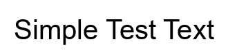
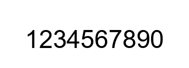
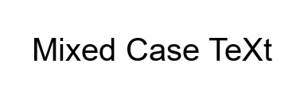
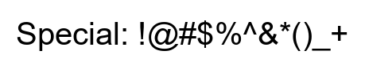
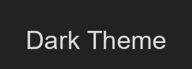

# Test Images for Unified Feature Extraction

This directory contains test images and their expected analysis results.

## Test Cases

| Name | Description | Preview | Text | Font | Text Color | BG Color |
|------|-------------|----------|------|------|------------|----------|
| simple_text | Test case: simple_text |  | `Simple Test Text` | Arial 40pt | `#000000` | `#FFFFFF` |
| numbers | Test case: numbers |  | `1234567890` | Arial 50pt | `#000000` | `#FFFFFF` |
| mixed_case | Test case: mixed_case |  | `Mixed Case TeXt` | Arial 40pt | `#000000` | `#FFFFFF` |
| special_chars | Test case: special_chars |  | `Special: !@#$%^&*()_+` | Arial 40pt | `#000000` | `#FFFFFF` |
| colored_text | Test case: colored_text |  | `Colored Text` | Arial 45pt | `#460078` | `#F0F0FF` |
| dark_theme | Test case: dark_theme |  | `Dark Theme` | Arial 42pt | `#DCDCDC` | `#222222` |

## Expected Results

Each test case has a corresponding JSON file with the expected analysis results. The results follow the analysis schema.
